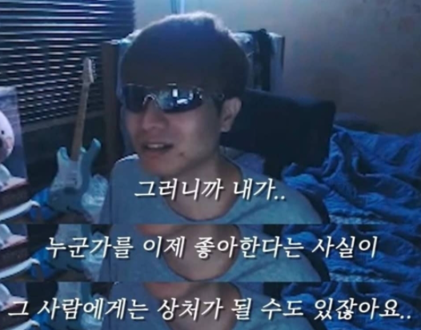

### 있었던 일들 📔
- 아침에 정수님께 코드 리뷰를 받았습니다. 역시나 많이 혼났습니다...😂
- 짰던 코드를 아예 갈아엎고 새롭게 짜기 시작했습니다. 오히려 좋아...!
- 제가 구현하고 있는 기능이 준섭님의 코드에 들어갈 부분이기에 회의를 하며 데이터 형식을 맞췄습니다. 오랜만에 협업하는 기분이 들어 즐거웠습니다 ㅎㅎ
- 요즘 어썸데브블로그라는 곳에서 다른 분들의 글을 읽고 있습니다. 생각보다 쓸데없는 글도 많아서 조금 당황하기도 합니다 ㅋㅋㅋ

### 느낀점 😋
- 매번 정수님의 시간을 너무 많이 뺏는것 같아 죄송한 마음입니다. 제가 잘못짠 코드가 동료분들에게 얼마나 큰 피해가 가는 일인지 다시 한 번 느낍니다.  
> 그러니까 제가... 이상하게 코드를 짰다는 사실이 다른 동료분들에게는 큰 시련이 될 수 있잖아요...  
  

- 정수님께는 죄송하지만 피드백 시간은 저에게는 너무 즐겁고, 유익한 시간입니다. 코드리뷰 짜릿해. 늘 새로워. 2달의 인턴 기간 동안 정수님께 잘 짜셨네요 라는 말을 한 번쯤 듣고 싶었지만 아무래도 힘들 것 같네요. 분발해야지...
- 화요일에 전환 인터뷰를 말아먹고 세상에서 제일 다운된 상태였는데 생각보다 빠르게 회복됐습니다. 재밌게 코드 짤 생각하니 금방 치유됐습니다 ㅎㅎ

### 배운점 📝
- 뜬금없지만 create, make, build의 차이에 대해 좀 인지를 하게됐습니다. 네이밍을 할 때 자주 사용하는 단어들인데 create는 무에서 유를 창조하는 느낌, make는 이미 있는 것을 토대로 뭔가를 다시 만드는 느낌, build는 make를 조합하는 느낌이라네요... 생각보다 굉장히 네이밍할 때 요긴하게 쓰일 것 같아요!
- 분기처리가 있는 함수는 무.조.건 테스트 코드를 작성해야 한다는 점!
- parameter의 순서 역시 중요도, 사용 순서 등을 고려하여 정해주면 읽을 때 훨씬 편합니다.

### 계획 🗓
- 내일까지 개선하고 있는 코드를 완성시키고 PR을 머지 시킬 계획입니다.
