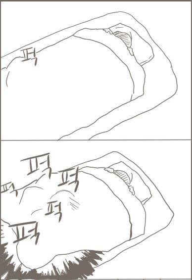

### 있었던 일들 📔
- 당당하게 정수님께 새롭게 짠 코드를 보여드렸고, 덤덤하게 피드백 많이 받았습니다...ㅎㅎ
  
- 토스 채용 공고 사이트를 확인하다가 업적이라는 재밌는 기능을 넣어둔 것을 확인했습니다. 개인의 업적을 어떻게 측정할까? 쿠키 같은 곳에 저장하나 하면서 개발자 도구를 열고 있는 제 모습을 발견했습니다. (참고로 정답은 로컬 스토리지였어요 ㅎㅎ)
- 카카오 웹툰이 출시됐습니다. 프론트엔드 개발자다보니 출시전부터 강조하던 UI, UX가 궁금해서 업무가 끝나고 한 번 들여다봤습니다. [**후기 링크**](https://jinhyukoo.github.io/%ED%9B%84%EA%B8%B0/2021/08/02/%EC%B9%B4%EC%B9%B4%EC%98%A4%EC%9B%B9%ED%88%B0%EC%82%AC%EC%9A%A9%ED%9B%84%EA%B8%B0.html)
- 앞머리가 눈을 찌르기 시작하네요. 시간이 참 빠르다는 걸 느낍니다.

### 느낀점 😋
- 가장 떨리는 시간이지만 가장 즐거운 코드 리뷰 시간~ 내 코드가 까이는건 슬프지만 막상 생각지 못한 좋은 방법을 제시해주시면 오 이렇게 하면 되는구나 하면서 기분이 좋아집니다. 좀 이상해...
- 예전에 이미지를 pdf로 변환시켜주는 홈페이지를 이용하다 횟수 제한 5회가 있는걸 보고 '음... 쿠키나 로컬 스토리지에 기록을 하고 있지 않을까?' 하고 메모리를 날렸더니 다시 5번을 이용할 수 있었을 때가 있었습니다. 그러면서 뿌듯했던 기억이 있었는데 오늘 그 기억이 되살아났습니다 ㅎㅎ

### 배운점 📝
- 오늘도 외쳐본다! 코드 구조(레벨) 나누는 거 생각하자! 네이밍은 평생 간다!
- if 조건이 3개 이상일 때는 switch문을 고려해보자.
- 문자열 조합에는 join이라는 좋은 메소드가 존재한다.
- string에 + 연산자를 사용하는게 안티 패턴이었던 이유는 string이 immutable이기 때문에 연산이 될 때마다 새로운 메모리가 할당되는 이슈가 있었기 때문이라고 합니다. 지금은 브라우저에서 이러한 문제를 해결했기 때문에 성능에 별 문제가 없다고 하네요!

### 계획 🗓
- 결과와 관계없이 발표까지 잘 마무리해서 아쉬움 없이 인턴을 끝내고 싶네요!
- 덮어뒀던 한표를 다시 꺼낼 때가 됐습니다. 기존 한표 멤버에 창희님이 백엔드 멤버로 추가되셔서 5명이서 멋진 시간표 어플을 만들 계획입니다!
- 미용실 예약을 합시당~