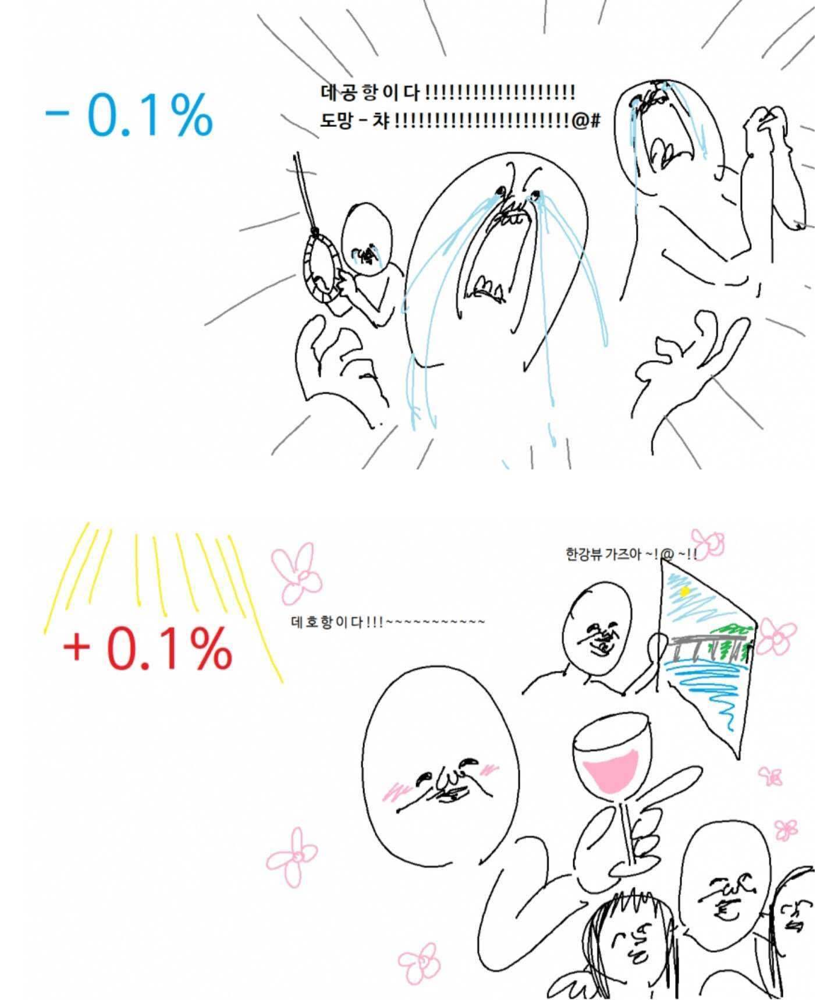

### 있었던 일들 📔
- todoMV-를 클론해보는 중입니다. 이 과정에서 observer 패턴이나 MV- 패턴에 대해 구현 + 공부중인데 아는 것 같으면서도 매번 새로운 걸 배우는 부분인 것 같아요. 다른 분들이 짜놓은 코드를 보며 감탄하기도 하고 아직 갈 길이 멀구나 싶기도 합니다. [상태관리 관련 강추하는 글 - 황준일님 블로그](https://junilhwang.github.io/TIL/Javascript/Design/Vanilla-JS-Store/#_1-object-defineproperty-%E1%84%8B%E1%85%B5%E1%84%92%E1%85%A2%E1%84%92%E1%85%A1%E1%84%80%E1%85%B5)
- 자바스크립트 스킬업이라는 책을 읽고 있습니다. 책 내용을 정리해서 레포에 남기고 싶었지만 시간이 생각보다 많지 않아서 그렇게 하기는 힘드네요.
- async/await 문법으로 promise를 모두 대체할 수 있을까요? 문득 궁금하네요... 공부가 더 필요한 부분...!
- 짜파게티 범벅 컵라면 30개를 주문했어요. 이것이 직장인의 Flux...
- 가볍게 50만원 정도로 코인을 하고 있는데 오늘 떡락했네요... 돔황챠...

  

### 느낀점 😋
- 요즘 기록하는 습관이 점점 줄어드는 것 같아요. 입사 초기라서 이것저것 정신이 없기도 하고 뭔가 한 단계 산을 넘어서 그런지 나태해진 것 같기도 하네요. 동기부여를 해줄 무언가가 필요합니다 ㅋㅋ
- 아직 제대로 맡은 부분이 없어서 그런지 뭔가 일을 하는 느낌이 안 들어요. 그리고 저는 뭔가 책보다는 직접 부딪히면서 배우는 성향이라 그런 것 같기도 하네요. 입사하고 1년이 지나신 민수님도 아직 본인이 온전히 담당하신 부분은 없으신 것 같던데, 과연 저는 언제쯤 1인분을 하는 개발자가 될 지...
- 아직 기본기가 많이 부족하구나 하는 걸 느낍니다. 특히 비동기쪽. 더 열심히 하자!

### 배운점 📝
- defineProperty라는 메서드를 통해 객체에 속성을 정의하고 getter와 setter를 설정할 수 있다는 것을 알았네요. 현재는 Proxy라는 더 발전된 메서드가 등장하기도 했습니다. 
- 프레임워크와 유사하게 컴포넌트를 구현하는 코드를 짜봤어요. 예전에 리액트 실제로 만들기라는 것을 해보려다가 시간이 없어서 못했는데 만약 했다면 이런 식으로 컴포넌트를 구현하지 않았을까 싶어요. 라이프 사이클에 대해 다시 한 번 생각해 볼 수 있는 시간이었습니다.

### 계획 🗓
- 짜파게티 범벅 3개 한 번에 먹기
